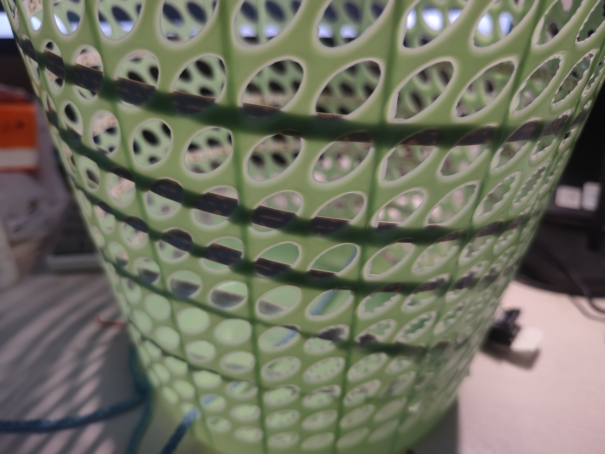
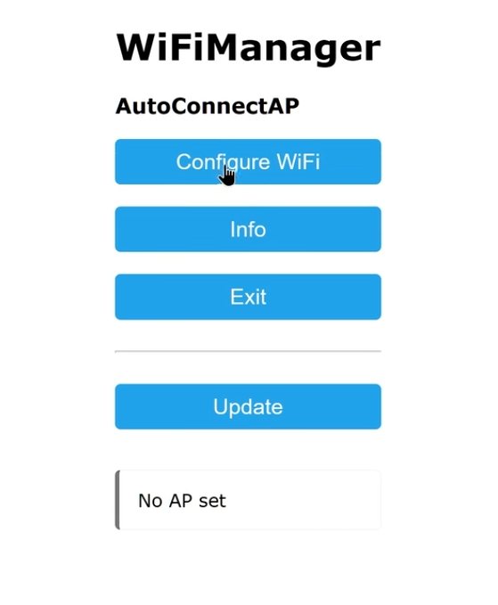
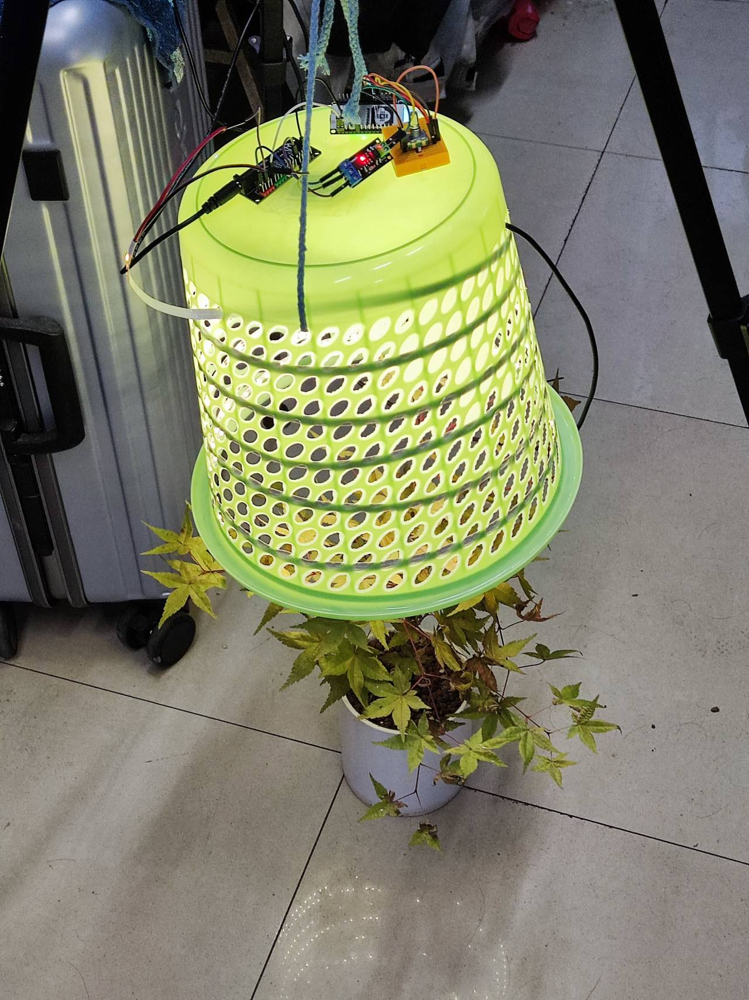

# 智能可调节植物补光灯
##1 使用的器材
### NodeMCU-8266
智能灯的主控芯片  

### 旋转编码器
用于开关灯以及调节灯的亮度  

### 12V-5V电源模块
用于给8266以及智能灯供电  

### 面包板
用于放置旋转编码器  

### MOSFET模块
控制灯带的输入电压来调节等待亮度  

### 12V电源
用于供电  

### 杜邦线若干
用于各硬件模块的连接  

### 可透气塑料罩
充当灯泡（不是）  

### 灯带若干米长
长度看情况，白灯或者日光灯  

### 一个架子
用于悬挂塑料罩  

## 安装与连接
###1 连接电路
D5 -- EC11(D) D6 -- EC11(A) D7 -- EC11(B) GND -- EC11(C) -- EC11(E) D4 -- MOSFET模块(PWM) GND -- MOSFET模块(GND)
###2 给8266烧录固件
使用tasmotizer烧录  

###3 8266的WIFI模块配置
连接8266的热点，进入后选择自己的wifi进行配置  

###3 想办法将灯带粘贴在罩子上（如图）
八仙过海了

###4 连接8266
用ipad或者iphone搜寻并连接设备即可
## 最后的效果如图
